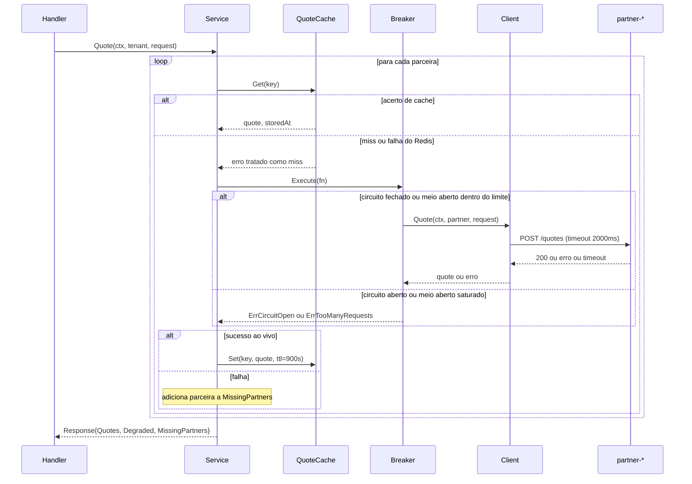

### FDD: Resiliência de parceiras (circuit breaker, cache e fallback parcial)

Versão: 1.0
Data: 2026-09-27
Responsável: Wesley Taumaturgo

---

### 1. Contexto e motivação técnica

`internal/partner/client.go` chama cada parceira sem proteção nenhuma: `NewClient` cria
`&http.Client{Transport: platform.InstrumentTransport(http.DefaultTransport)}` sem o campo `Timeout`
(linhas 23-28), e qualquer falha de qualquer parceira propaga o erro até
`internal/quotation/service.go:31-34`, que aborta a agregação inteira (`return Response{}, err` dentro do
laço `for _, p := range s.partners`). A `partner-flaky` falha 40% das vezes e tem uma rajada determinística
de 9 falhas consecutivas nas sequências 49 a 57 (`docker-compose.yml:164-170`, travada por
`cmd/partner-mock/feasibility_test.go`). A `partner-degrading` nunca falha, só afunda: acima de 5 chamadas
simultâneas soma 300 ms por chamada extra até o teto de 6000 ms (`docker-compose.yml:177-191`), e sem um
teto de espera essa lentidão nunca vira sinal para um contador de falhas. O Redis já sobe em
`docker-compose.yml:133-145` e nenhum código fala com ele.

Esta fatia implementa as decisões 1, 2 e 3 da seção 4 do SAD (`docs/sad.md`): um circuit breaker por
parceira, um cache por parceira no Redis, e resposta parcial no lugar do "tudo ou nada" atual. Ela cobre
exatamente os arquivos listados na seção 5 do SAD (implementação), mais dois pacotes novos.

**Atores:** `quotation-api` (processo sob mudança), as três parceiras mock (`partner-slow`,
`partner-flaky`, `partner-degrading`, sistemas externos via HTTP), Redis (cache, contêiner já existente),
o coletor OTel (observabilidade, já existente), e a corretora consumidora do contrato HTTP
(`POST /quotes`).

**Limites do escopo:** esta fatia não resolve nenhum dos quatro limites conhecidos do SAD (limite de
chamadas simultâneas por parceira, breaker distribuído entre réplicas, invalidação ativa de cache,
isolamento de capacidade por tenant). Também não toca a decisão de hospedagem (seção 5, cloud pública e
armazenamento WORM de auditoria): essa decisão não tem artefato de código nesta entrega, é infraestrutura
fora do escopo desta fatia.

**Suposições:**
- S1: o laço de consulta às três parceiras continua sequencial (como hoje), não paralelo; nada nesta
  entrega pede paralelismo, e introduzi-lo mudaria o comportamento de concorrência simultânea contra
  `partner-degrading` de forma não solicitada.
- S2: `service.Quote` deixa de retornar `error` por falha de parceira individual; falhas de parceira viram
  entradas em `MissingPartners`, nunca abortam o laço. Um `error` só volta do `service.Quote` em uma
  condição verdadeiramente inesperada (por exemplo, contexto cancelado antes de qualquer chamada).

**Restrições:** a chave de cache, o TTL, o formato do contrato de resposta e os nomes das seis variáveis de
configuração são normativos (vêm do SAD, seção 4 e 5, e do pedido desta entrega), não sujeitos a
reinterpretação nesta fatia.

---

### 2. Objetivos técnicos

- O breaker abre depois de exatamente 5 falhas consecutivas, verificado por teste determinístico com um
  `httptest.Server` cujo script fixo de respostas espelha a rajada real de 9 falhas consecutivas nas
  sequências 49-57 de `partner-flaky`, sem importar `cmd/partner-mock`; invariante: a 5ª falha consecutiva
  impede a 6ª chamada de sair do processo, verificado pelo contador de requisições do próprio servidor de
  teste.
- Um acerto de cache nunca é tratado como degradação; invariante: `degraded == true` se e somente se
  `missing_partners` não está vazio, mesmo quando alguma das quotes tem `source: "cache"`.
- Falha do Redis é best effort; invariante: nenhuma falha de conexão ao Redis pode transformar uma
  requisição bem-sucedida ao vivo em erro.
- A resposta é parcial por padrão; invariante: `POST /quotes` só retorna erro de negócio (`503`) quando
  nenhuma das três parceiras produz prêmio, nem ao vivo nem em cache.
- As seis variáveis novas de configuração seguem o padrão de validação já existente
  (`parsePartners`/`parseTenants`); invariante: valor inválido (não numérico onde se espera número, URL
  inválida no `REDIS_ADDR`) falha o boot com mensagem no mesmo formato das validações existentes, nunca
  silenciosamente.

---

### 3. Escopo e exclusões

**Incluído**
- `internal/partner/client.go`: `NewClient` passa a receber um `timeout time.Duration` e aplicá-lo ao
  `http.Client`.
- `internal/resilience/breaker.go` (novo): wrapper de `gobreaker/v2`, um por `platform.Partner`.
- `internal/cache/quote_cache.go` (novo): `QuoteCache` sobre `go-redis/v9`, chave
  `quote:v1:<tenant_id>:<partner_name>:<hash>`, TTL 900s, best effort.
- `internal/quotation/service.go`: reescreve `Quote` para orquestrar cache → breaker → cliente por
  parceira, sem abortar no primeiro erro; monta `Degraded`/`MissingPartners`.
- `internal/quotation/handler.go`: `respondPartnerFailure` ganha o caminho `503` para falha total; o `400`
  de `X-Tenant-Id` ausente não muda.
- `internal/quotation/request.go`: `Response` ganha `Degraded`/`MissingPartners`; `partner.Quote` ganha
  `Source`/`AgeSeconds`; `Request` ganha `Fingerprint() string`, usado para compor a chave de cache sem que
  `internal/cache` precise importar `internal/quotation` (evita ciclo de import entre os dois pacotes).
- `internal/platform/config.go`: seis variáveis novas.
- `internal/platform/telemetry.go`: nenhuma mudança estrutural nesta fatia além de expor os pontos de
  instrumentação que o breaker e o cache já publicam via `otel` diretamente (métricas descritas na seção 7).
- `cmd/quotation-api/main.go`: instancia os três breakers, o cliente Redis e o `QuoteCache`, ajusta a
  chamada a `partner.NewClient` para o novo parâmetro de timeout.
- Os dois testes determinísticos exigidos: abertura do breaker com um `httptest.Server` e um script fixo
  de respostas que espelha a rajada de 9 falhas consecutivas de `partner-flaky` (sequências 49-57), sem
  importar `cmd/partner-mock`; e cache mais fallback com `miniredis`.

**Excluído**
- Limite de chamadas simultâneas por parceira (limite conhecido 1 do SAD).
- Estado de breaker compartilhado entre réplicas (limite conhecido 2).
- Qualquer invalidação de cache além do TTL nativo do Redis, inclusive endpoint de purga (limite
  conhecido 3).
- Isolamento de capacidade por tenant (limite conhecido 4).
- Decisão de hospedagem, armazenamento WORM de auditoria e qualquer mudança em `docker-compose.yml`
  (seção 5 do SAD é sobre onde roda, não sobre este código; o compose já sobe o Redis e as três parceiras
  como estão).
- Paralelização das três chamadas de parceira (suposição S1).

---

### 4. Fluxos detalhados e diagramas

**Fluxo principal (por requisição `POST /quotes`)**

1. `handler.quote` valida `X-Tenant-Id` (400 se ausente) e decodifica/normaliza o corpo (400 se inválido).
   Sem mudança nesta fatia.
2. `service.Quote` itera sobre as três parceiras, sequencialmente (S1). Para cada parceira:
   1. Calcula `fingerprint := request.Fingerprint()` (campos já normalizados por `Normalize()`, unidos por
      `|`) e monta a chave via `key := cache.Key(tenant, p.Name, fingerprint)`, que aplica o SHA-256 sobre
      o fingerprint e retorna `quote:v1:<tenant_id>:<partner_name>:<hash>` (16 primeiros caracteres hex).
   2. `QuoteCache.Get(ctx, key)`: em acerto, usa o valor armazenado, calcula `AgeSeconds` a partir do
      instante gravado, marca `Source: "cache"`, adiciona a quote à lista e passa para a próxima parceira
      sem consultar o breaker.
   3. Em erro de acerto (miss real ou falha do Redis, tratada como miss best effort): chama
      `breaker.Execute(ctx, func() (partner.Quote, error) { return client.Quote(ctx, p, forPartner) })`.
      - Se o breaker está aberto: `Execute` retorna `resilience.ErrCircuitOpen` sem que a chamada HTTP
        saia do processo.
      - Se está em meio aberto e já atingiu `MaxRequests` (2): retorna `resilience.ErrTooManyRequests`.
      - Caso contrário, chama `client.Quote`, sujeito ao timeout de 2000 ms; timeout conta como falha
        para o breaker.
   4. Sucesso ao vivo: marca `Source: "live"`, grava no cache (`QuoteCache.Set`, best effort, TTL 900s),
      adiciona a quote.
   5. Qualquer falha (circuito aberto, meio aberto saturado, timeout, erro HTTP da parceira): adiciona o
      nome da parceira a `MissingPartners`, não interrompe o laço.
3. Ordena as quotes coletadas por `PremiumCents` crescente (comportamento existente, mantido).
4. `service.Quote` retorna sempre `(Response, nil)` nesta via, exceto na condição inesperada de S2.
5. `handler.quote`:
   - Se `len(response.Quotes) == 0`: responde `503 {"error":"no partner quote available","tenant_id":...,
     "missing_partners":[...]}`.
   - Senão: responde `200` com `Response{TenantID, Quotes, ElapsedMs, Degraded, MissingPartners}`.

**Fluxos alternativos e exceções**

- **Falha do Redis (timeout de conexão, `ECONNREFUSED`):** `QuoteCache.Get`/`Set` retornam erro interno,
  tratado como miss silencioso; a chamada segue para o breaker normalmente, sem abortar a requisição
  (decisão 2, "falha do Redis é best effort").
- **Breaker abre no meio do laço de uma mesma requisição:** não se aplica dentro de uma única requisição
  (cada parceira só é chamada uma vez por requisição), mas se aplica entre requisições concorrentes: uma
  vez aberto, toda nova requisição para aquela parceira recebe `ErrCircuitOpen` imediatamente até o timer
  de 5s.
- **Meio aberto com mais de 2 chamadas simultâneas:** `gobreaker/v2` rejeita a chamada excedente com
  `ErrTooManyRequests`; tratado como falha da parceira para fins de resposta parcial, sem contar como nova
  falha consecutiva que reabra o circuito.
- **Timeout do `http.Client` (2000 ms):** conta como falha para o breaker (`ReadyToTrip` via
  `Counts.ConsecutiveFailures`), do mesmo jeito que um erro HTTP.
- **As três parceiras falham (nem ao vivo, nem em cache):** `503`, distinto do `502` de hoje.
- **Erro verdadeiramente inesperado em `service.Quote` (S2):** cai no branch remanescente de
  `respondPartnerFailure`, que responde `502` genérico; este caminho não é mais alcançado por falha comum
  de parceira, só por erro de programação ou infraestrutura fora do modelo desta fatia.

**Diagrama de sequência (uma parceira, caso geral)**



---

### 5. Contratos públicos (assinaturas, endpoints, headers, exemplos)

**`internal/resilience.Breaker`**
- Tipo: struct/method (pacote novo)
- Assinatura:
  ```go
  type Config struct {
      ConsecutiveFailures uint32
      OpenTimeout         time.Duration
      HalfOpenMaxRequests uint32
  }

  func NewBreaker(name string, cfg Config) *Breaker
  func (b *Breaker) Execute(ctx context.Context, fn func() (partner.Quote, error)) (partner.Quote, error)
  func (b *Breaker) State() gobreaker.State
  ```
- Semântica: `Execute` chama `fn` só se o circuito está fechado ou em meio aberto dentro de
  `HalfOpenMaxRequests`; caso contrário retorna `ErrCircuitOpen`/`ErrTooManyRequests` sem chamar `fn`.
  `State()` existe para telemetria e para os testes lerem o estado sem depender de contagem de chamadas.

**`internal/quotation.Request.Fingerprint()`** (novo, resolve o ciclo de import)
- Tipo: method
- Assinatura: `func (r Request) Fingerprint() string`
- Semântica: retorna a concatenação, separada por `|`, dos campos já normalizados por `Normalize()`
  (documento, ano de nascimento, placa, modelo, ano do veículo, valor em centavos, cobertura). Não calcula
  hash nenhum, isso é responsabilidade de `cache.Key`. Com isso, `internal/cache` nunca importa
  `internal/quotation`: só `internal/quotation` (que já importa `internal/cache` para orquestrar o
  cache-aside) chama `Fingerprint()` e passa a `string` resultante para `cache.Key`.

**`internal/cache.QuoteCache`**
- Tipo: struct/method (pacote novo)
- Assinatura:
  ```go
  func NewQuoteCache(client *redis.Client, ttl time.Duration) *QuoteCache
  func Key(tenantID, partnerName, fingerprint string) string
  func (c *QuoteCache) Get(ctx context.Context, key string) (quote partner.Quote, storedAt time.Time, ok bool)
  func (c *QuoteCache) Set(ctx context.Context, key string, quote partner.Quote) error
  ```
- Semântica: `Key` recebe o `fingerprint` já pronto (calculado por `quotation.Request.Fingerprint()`) e
  aplica o SHA-256 internamente; `internal/cache` só lida com `string`, nunca com o tipo `quotation.Request`.
  `Get` retorna `ok == false` tanto em miss real quanto em falha do Redis (best effort); nunca retorna erro
  para o chamador, só loga internamente. `Set` retorna erro só para quem quiser logar; o chamador
  (`service.Quote`) ignora o erro de propósito.

**`internal/partner.Client` (estendido)**
- Assinatura: `func NewClient(timeout time.Duration) *Client` (hoje `func NewClient() *Client`, sem
  parâmetro). Mudança de assinatura, não aditiva: todo chamador (`cmd/quotation-api/main.go`) precisa ser
  atualizado no mesmo commit.

**`POST /quotes` (contrato de resposta estendido)**
- Tipo: http_endpoint
- Rota: `POST /quotes` (inalterada)
- Método: `POST`
- Headers:
  - `X-Tenant-Id` (requisição, obrigatório): inalterado, `400` se ausente.
  - `X-Tenant-Id` (resposta): inalterado, ecoa o tenant.
- Semântica de status:
  - `200`: pelo menos uma parceira produziu prêmio (ao vivo ou de cache).
  - `400`: `X-Tenant-Id` ausente ou corpo inválido, inalterado.
  - `503`: nenhuma parceira produziu prêmio, novo nesta fatia.
  - `502`: reservado a erro inesperado fora do modelo de falha de parceira (S2); não é mais o caminho
    esperado para uma parceira fora do ar.

**Exemplo de requisição** (inalterado, referência)
```json
{
  "driver": {"document": "12345678900", "birth_year": 1990},
  "vehicle": {"plate": "ABC1D23", "model": "Onix", "year": 2022, "value_cents": 6000000},
  "coverage": "comprehensive"
}
```

**Exemplo de resposta, `200`, parcial**
```json
{
  "tenant_id": "corretora-a",
  "quotes": [
    {"partner": "partner-slow", "quote_id": "...", "premium_cents": 91234, "currency": "BRL",
     "coverage_cents": 5000000, "valid_for_seconds": 300, "source": "live"},
    {"partner": "partner-flaky", "quote_id": "...", "premium_cents": 84210, "currency": "BRL",
     "coverage_cents": 5000000, "valid_for_seconds": 300, "source": "cache", "age_seconds": 47}
  ],
  "elapsed_ms": 1873,
  "degraded": true,
  "missing_partners": ["partner-degrading"]
}
```
`degraded` é sempre serializado (`true`/`false`, sem `omitempty`); `missing_partners` usa `omitempty`
(omitido quando as três respondem); `age_seconds` usa um ponteiro com `omitempty` (omitido quando
`source == "live"`, presente, inclusive quando igual a zero, quando `source == "cache"`).

**Exemplo de resposta, `503`, falha total**
```json
{
  "error": "no partner quote available",
  "tenant_id": "corretora-a",
  "missing_partners": ["partner-slow", "partner-flaky", "partner-degrading"]
}
```

**Limites**
- Timeout por chamada de parceira: 2000 ms (`PARTNER_TIMEOUT_MS`).
- TTL de cache: 900 s (`CACHE_QUOTE_TTL_SECONDS`).
- Sem limite de tamanho de payload novo além do já existente (`requestLimit`/`responseLimit`, 1 MiB).
- Versionamento: a chave de cache carrega `v1` explícito; qualquer mudança nos campos normalizados que
  compõem o hash exige `v2` para não colidir com entradas antigas.

---

### 6. Erros, exceções e fallback

**Matriz de erros**

| Condição | Tratamento | Notas |
|---|---|---|
| `X-Tenant-Id` ausente | `400 {"error":"X-Tenant-Id is required"}` | Inalterado |
| Corpo inválido ou campo obrigatório ausente | `400` com mensagem de validação | Inalterado |
| Cache miss (Redis respondeu, chave não existe ou expirou) | Segue para o breaker | Não é erro |
| Falha de conexão com o Redis | Tratada como miss, loga aviso, segue para o breaker | Best effort, decisão 2 |
| Circuito aberto para a parceira | Parceira entra em `missing_partners`, chamada HTTP não sai do processo | `resilience.ErrCircuitOpen` |
| Meio aberto saturado (mais de 2 chamadas concorrentes) | Parceira entra em `missing_partners` | `resilience.ErrTooManyRequests`, não conta como nova falha para reabrir |
| Timeout de 2000 ms na chamada HTTP | Parceira entra em `missing_partners`; conta como falha para o breaker | Decisão 1 |
| Erro HTTP da parceira (`4xx`/`5xx`) | Parceira entra em `missing_partners`; conta como falha para o breaker | `*partner.Error` |
| Uma ou duas parceiras ausentes, ao menos uma respondeu | `200`, `degraded: true`, `missing_partners` preenchido | Decisão 3 |
| Nenhuma parceira respondeu (ao vivo ou cache) | `503 {"error":"no partner quote available",...}` | Substitui o `502` de hoje para este caso |
| Erro inesperado antes do laço por parceira (contexto cancelado, etc.) | `502` genérico (`respondPartnerFailure`, branch remanescente) | S2, fora do modelo comum de falha de parceira |

**Estratégias de resiliência:** timeout (2000 ms por chamada), circuit breaker (5 falhas consecutivas
abrem, 5 s aberto, 2 sondas em meio aberto), cache-aside como amortecedor de carga (não é retry, é evitar a
chamada quando há uma resposta válida recente). Sem retry automático nesta fatia: uma falha de parceira
numa requisição não tenta a mesma parceira de novo dentro da mesma requisição, só via requisições futuras
naturais da corretora.

**Política de fallback:** resposta parcial é a estratégia primária; "cotação anterior" é coberta pelo
cache-aside da decisão 2, não é uma segunda tentativa; recusa explícita (`503`) só no caso degenerado em
que as três parceiras faltam.

**Invariantes:**
- `degraded == true` se e somente se `len(missing_partners) > 0`.
- Um acerto de cache nunca aparece em `missing_partners`.
- Nenhuma falha de Redis pode impedir uma resposta que teria sido bem-sucedida ao vivo.
- O CPF, a placa e qualquer dado de `Driver`/`Vehicle` nunca entram em claro na chave de cache nem no valor
  armazenado (só como entrada do hash SHA-256).

---

### 7. Observabilidade

**Métricas**
- `partner_breaker_state{partner=...}` (proposta): gauge, `0` fechado, `1` meio aberto, `2` aberto; emitida
  a cada transição de estado do `gobreaker/v2` (callback `OnStateChange`).
- `quotation_cache_result_total{result="hit"|"miss"|"redis_error"}` (proposta): contador, incrementado em
  todo `QuoteCache.Get`, com `redis_error` distinguindo falha de conexão de um miss real (mesma
  distinção do campo de log `cache_result`, abaixo).
- `http_server_request_duration_seconds`: já existe, inalterada.
- `http_client_request_duration_seconds{server_address=...}`: já existe, inalterada, agora também reflete
  o timeout de 2000 ms nas chamadas que estouram.

**Logs**
- Formato: estruturado, mesmo padrão de log já usado no serviço (chave-valor via `log` padrão ou o que já
  estiver em uso em `main.go`).
- Campos essenciais por parceira processada: `tenant_id`, `partner`, `source` (`live`/`cache`/`missing`),
  `breaker_state`, `elapsed_ms`, `cache_result` (`hit`/`miss`/`redis_error`), `error` (se houver, mensagem
  curta, nunca o corpo da requisição ao parceiro).
- Nenhum campo de log ou métrica carrega CPF, placa, modelo do veículo ou qualquer campo de
  `Driver`/`Vehicle` em claro.

**Tracing**
- Span de negócio `partner.quote`, um por parceira processada dentro de `service.Quote`.
- Atributo `partner.result`, valores: `cache_hit`, `live_success`, `circuit_open`, `too_many_requests`,
  `timeout`, `http_error`.
- Amostragem: `AlwaysSample()`, já configurado em `internal/platform/telemetry.go:49`, sem mudança.

**Dashboards e alertas mínimos**
- Painel de estado do breaker por parceira (série temporal de `partner_breaker_state`).
- Painel de taxa de acerto de cache (`quotation_cache_result_total`, hit sobre hit+miss).
- Alerta: taxa de `503` acima de um limiar (indica as três parceiras fora ao mesmo tempo, cenário raro que
  merece atenção imediata).
- Comparação de p95 de `http_server_request_duration_seconds` antes e depois desta entrega, para validar a
  RNF-01 do SAD (hoje 8,01 s sob carga padrão).

---

### 8. Dependências e compatibilidade

| Componente | Versão mínima | Observações |
| --- | --- | --- |
| `github.com/sony/gobreaker/v2` | v2.x mais recente no momento da implementação (hipótese: não fixada no `go.mod` ainda) | Ainda não está em `go.mod`; confirmar versão exata com `go get` na implementação |
| `github.com/redis/go-redis/v9` | v9.x mais recente compatível com Redis 7 (imagem `redis:7-alpine` do compose) | Idem, ainda não está em `go.mod` |
| `github.com/alicebob/miniredis/v2` | v2.x mais recente | Só em testes (`go.mod` como dependência de teste) |
| Go | 1.25.0 | Já fixado em `go.mod`, sem mudança |
| Redis (contêiner) | 7-alpine | Já sobe em `docker-compose.yml:133-145`, sem `--save`/`--appendonly` |

**Garantias de compatibilidade**
- O contrato de resposta muda de forma aditiva: `degraded` e `missing_partners` são campos novos em
  `Response`; `source` e `age_seconds` são campos novos em `partner.Quote`. Nenhum campo existente é
  removido ou renomeado.
- `POST /quotes` continua exigindo `X-Tenant-Id` e validando o corpo do mesmo jeito; o `400` não muda.
- `partner.NewClient` muda de assinatura (ganha `timeout time.Duration`); é uma mudança interna de
  construtor, não afeta o contrato HTTP externo, mas quebra qualquer chamador direto do pacote `partner`
  fora de `cmd/quotation-api/main.go` (nenhum conhecido hoje).
- Um consumidor que hoje assume sempre três itens em `quotes` precisa se adaptar; é uma mudança de
  contrato que exige aviso (decisão 3 do SAD), não uma mudança silenciosa.

---

### 9. Critérios de aceite técnicos

- `go build ./...` e `go vet ./...` passam sem erro após as mudanças.
- `go test ./...` passa, incluindo os dois testes determinísticos novos, de forma repetível (sem `sleep`
  no caminho testado; TTL de teste do `miniredis` controlado explicitamente pelo teste).
- Teste do breaker: `httptest.Server` com um script fixo de respostas, codificado no próprio teste (uma
  tabela de sucesso/falha por sequência), que espelha a rajada real de 9 falhas consecutivas de
  `partner-flaky` (sequências 49-57), sem importar `cmd/partner-mock`. O servidor de teste mantém um
  contador próprio de requisições recebidas; depois da 5ª falha consecutiva, a chamada seguinte ao breaker
  aberto não incrementa esse contador (prova de que a chamada não saiu do processo).
- Teste de cache e fallback: usando `miniredis`, verifica que uma parceira com entrada de cache válida
  aparece na resposta com `source: "cache"` e `age_seconds` presente; que uma parceira sem cache e sem
  resposta ao vivo aparece em `missing_partners` com `degraded: true`; e que, com as três parceiras sem
  cache e sem resposta ao vivo, a resposta é `503` com o corpo `{"error":"no partner quote available",...}`.
- Teste de configuração cobre as seis variáveis novas (`CACHE_QUOTE_TTL_SECONDS`, `PARTNER_TIMEOUT_MS`,
  `BREAKER_CONSECUTIVE_FAILURES`, `BREAKER_OPEN_SECONDS`, `BREAKER_HALF_OPEN_MAX_REQUESTS`, `REDIS_ADDR`),
  com valor padrão e valor inválido para ao menos uma delas.
- Uma resposta bem-sucedida com as três parceiras continua ordenada por `premium_cents` crescente
  (comportamento existente, RF-02).
- Nenhum CPF, placa, modelo ou ano do veículo aparece em claro em log, métrica ou valor armazenado no
  Redis (checagem manual do código de `internal/cache` e dos pontos de log novos).
- `502` deixa de ser produzido para o caso "uma parceira falhou, as outras responderam"; só aparece pelo
  branch remanescente de erro inesperado (S2).

---

### 10. Riscos e mitigação

### Timeout de 2000 ms confunde parceira lenta com parceira fora do ar

- **Probabilidade:** média
- **Impacto:** o breaker de `partner-slow` pode abrir por causa de rede real mais lenta que o jitter
  simulado (±200 ms só no mock), reduzindo disponibilidade sem uma causa real de instabilidade.
- **Mitigação:**
    - Manter o timeout configurável via `PARTNER_TIMEOUT_MS`, sem valor fixo no código.
    - Separar `partner.result` em `timeout` e `http_error` no span de negócio, para diagnóstico rápido de
      qual caso está ocorrendo.
    - Documentar a folga de 18% usada na escolha dos 2000 ms (SAD, decisão 1).
- **Plano de contingência:** aumentar `PARTNER_TIMEOUT_MS` via variável de ambiente, sem novo deploy de
  código.

### Estado do breaker em memória do processo (limite conhecido 2, não resolvido nesta fatia)

- **Probabilidade:** alta, assim que houver mais de uma réplica.
- **Impacto:** cada réplica aprende sozinha que uma parceira caiu; latência e custo inconsistentes entre
  requisições da mesma corretora.
- **Mitigação:**
    - Nenhuma nesta entrega; documentado explicitamente como limite conhecido, não como bug.
- **Plano de contingência:** rodar com réplica única até uma fatia futura introduzir estado compartilhado
  (fora do escopo desta entrega).

### TTL como única forma de invalidação de cache (limite conhecido 3, não resolvido nesta fatia)

- **Probabilidade:** baixa dentro da janela de 15 min, mas não nula.
- **Impacto:** uma corretora pode ver, por até 15 minutos, um prêmio que a parceira já não honra mais.
- **Mitigação:**
    - TTL de 900 s deliberadamente conservador, muito abaixo do teto comercial de 24 horas.
- **Plano de contingência:** reduzir `CACHE_QUOTE_TTL_SECONDS` via configuração em caso de incidente de
  preço reportado por uma parceira.

### Falha silenciosa do Redis mascarando um problema maior de infraestrutura

- **Probabilidade:** baixa.
- **Impacto:** o comportamento best effort pode esconder o Redis fora do ar por um período longo, sem que
  ninguém perceba, já que a aplicação continua respondendo (só mais devagar e mais cara, por ir sempre ao
  vivo).
- **Mitigação:**
    - `quotation_cache_result_total{result="miss"}` com possibilidade de alerta sobre taxa anômala de miss
      sustentada.
    - Log de aviso distinto para "miss por falha de conexão" versus "miss por chave ausente/expirada".
- **Plano de contingência:** painel dedicado de disponibilidade do Redis (fora do escopo de código desta
  fatia, é configuração de observabilidade).

### Mudança de contrato de resposta quebra consumidor que assume sempre três `quotes`

- **Probabilidade:** média, depende de quantos consumidores fazem parsing estrito.
- **Impacto:** corretora que não trata `degraded`/`missing_partners` pode processar uma resposta parcial
  como se fosse completa.
- **Mitigação:**
    - Campos só aditivos, nenhum campo existente removido ou renomeado.
    - `degraded` sempre presente (nunca omitido), para permitir checagem simples por quem quiser ignorar
      `missing_partners`.
- **Plano de contingência:** comunicar a mudança de contrato como aviso formal às corretoras antes do
  rollout; versionamento de endpoint fica fora do escopo desta entrega.

### O script fixo do teste do breaker diverge do comportamento real de `partner-flaky`

- **Probabilidade:** baixa.
- **Impacto:** como o teste do breaker usa um `httptest.Server` com script fixo, desacoplado de
  `cmd/partner-mock`, ele continuaria passando mesmo se o mock real mudasse de semente ou taxa de falha;
  o teste prova o comportamento do breaker em isolamento (abre na 5ª falha consecutiva, não faz a 6ª
  chamada), não prova que a rajada real de `partner-flaky` ainda existe.
- **Mitigação:**
    - A rajada real de 9 falhas consecutivas nas sequências 49-57 continua coberta separadamente por
      `cmd/partner-mock/feasibility_test.go` e pela execução de `make reproduce`, que são a fonte de
      verdade sobre o comportamento do mock, não o teste do breaker.
    - Qualquer mudança na semente ou na taxa de falha do mock quebra `feasibility_test.go` primeiro,
      antes de qualquer efeito sobre o teste do breaker (que nem importa o mock).
- **Plano de contingência:** se `feasibility_test.go` ou `make reproduce` indicarem que a rajada real
  mudou, atualizar o script fixo do teste do breaker no mesmo commit para continuar espelhando o cenário
  real, mantendo a rastreabilidade já documentada em `docs/work/sad/rastreabilidade.md`.
