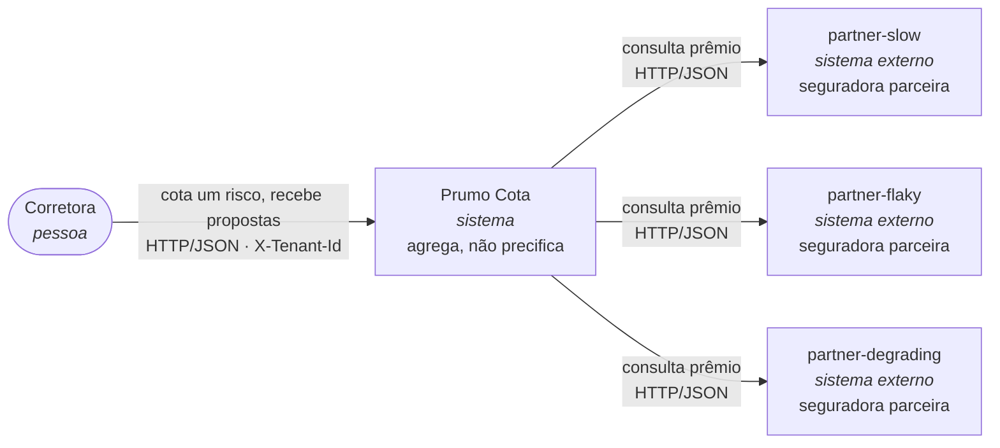
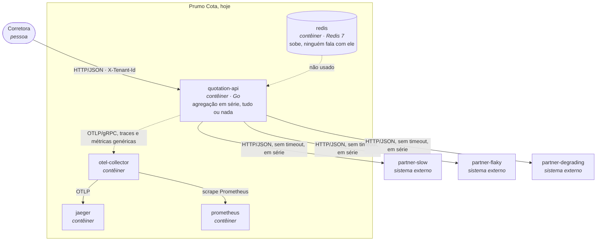
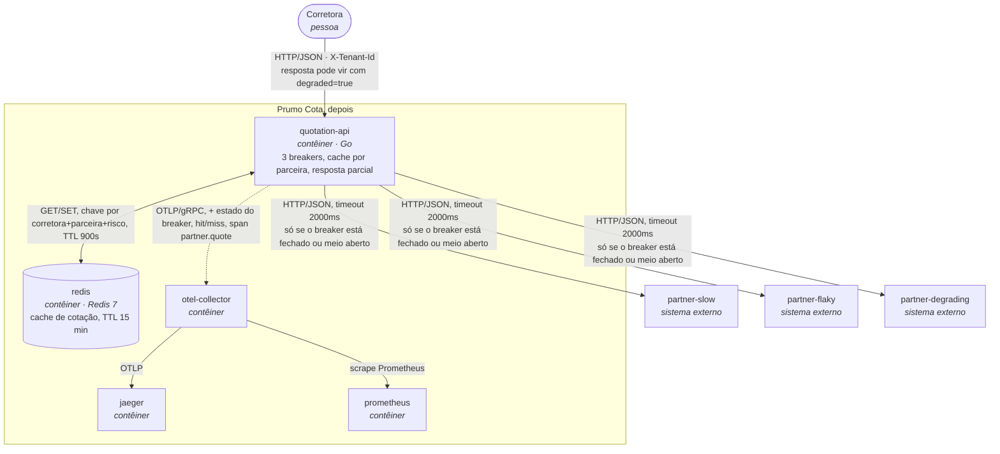
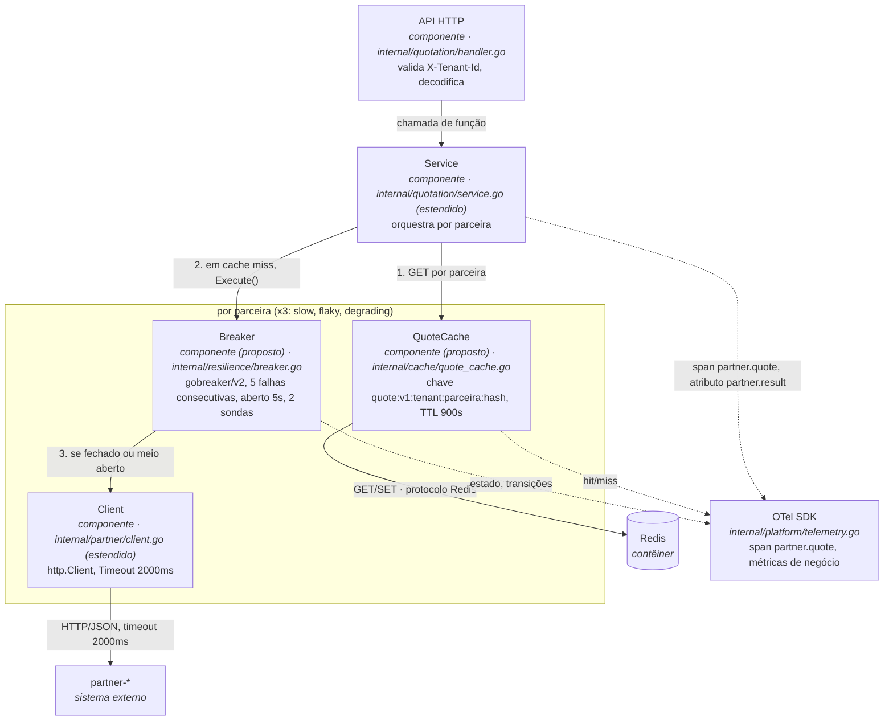

# SAD: Prumo Cota, fronteira com as seguradoras parceiras

Versão: 1.0
Data: 2026-09-27
Responsável: arquitetura da entrega (autor do fork)

> **Nota de rastreabilidade.** Este documento descreve a plataforma **depois** da intervenção proposta
> para a Entrega 2. Nenhuma linha de código foi alterada até o momento em que este SAD foi escrito: os
> caminhos `internal/partner/client.go`, `internal/quotation/service.go`, `internal/quotation/handler.go`,
> `internal/quotation/request.go`, `internal/platform/config.go`, `internal/platform/telemetry.go`,
> `cmd/quotation-api/main.go` e `docker-compose.yml` existem e são citados como estão hoje no
> repositório. Tudo o que ainda não existe, os pacotes `internal/resilience/` e `internal/cache/`, os
> parâmetros novos de `internal/platform/config.go` e os campos novos de `Response`, está marcado
> **(proposto)** e é o que a Entrega 2 constrói a partir deste documento.

---

## 1. Introdução

### Propósito e a quem serve

Este SAD decide e justifica como a **Prumo Cota** (a `quotation-api`) para de propagar a instabilidade
das três seguradoras parceiras (`partner-slow`, `partner-flaky`, `partner-degrading`) para a corretora,
sem deixar de ser auditável e sem misturar dado de uma corretora com o de outra. Ele serve a três
leitores: o **CTO da Prumo**, que aprova o gasto de infraestrutura da seção 8; o **plantonista**, que
opera pelo runbook da seção 6; e o **encarregado de dados e auditoria**, que usa as seções 4 e 8 para
provar à ANPD e à SUSEP que a cotação de cache continua rastreável e isolada por corretora.

### Escopo

Cobre a fronteira entre a `quotation-api` e as três parceiras: o cliente HTTP
(`internal/partner/client.go`), a agregação (`internal/quotation/service.go`), o contrato de resposta
(`internal/quotation/request.go`) e a configuração que os alimenta
(`internal/platform/config.go`). Cobre três mecanismos, e só três: **circuit breaker**, **cache** e
**fallback**. Não cobre a **paralelização da agregação** (item de bônus do enunciado, não implementado
nesta entrega e citado apenas como trabalho futuro na seção 4), nem qualquer item explicitamente fora de
escopo do enunciado (retry com backoff, bulkhead, rate limiting, fila, autenticação, Kubernetes,
persistência de auditoria de verdade). Não cobre o motor de precificação das seguradoras nem o CRM da
corretora, que são sistemas de terceiros fora do controle da Prumo.

### Restrições (impostas, não decididas por este documento)

| Restrição | Origem |
|---|---|
| Go 1.25, Docker Compose v2, Redis, OpenTelemetry | README, seção "As regras não negociáveis" |
| `cmd/partner-mock/` e seus perfis (`PARTNER_SEED`, `PARTNER_FAILURE_RATE`, latências) não podem ser alterados | README, mesma seção |
| Cobrança por consulta ao motor de precificação, não por venda | README, "O cenário: negócio, custo e regulação" |
| Retenção de auditoria de 5 anos, cotação sempre rastreável até a consulta que a originou | README, "O que a regulação impõe" |
| Prumo é operadora de dados pessoais, a corretora é controladora (LGPD) | README, idem |
| `make test` e os testes existentes continuam verdes | README, "As regras não negociáveis" |

### Decisões (deste documento, seção 4 e 5)

TTL do cache, limiares e escopo do circuit breaker, o que o fallback devolve, e onde a plataforma roda.
Nenhuma delas é imposta pelo enunciado; todas são defendidas com número nas seções 4, 5 e 8.

### Pressupostos

| # | Pressuposto | Valor | Origem | Consequência se falso |
|---|---|---|---|---|
| P1 | Fração das cotações diárias que são recotação do mesmo risco pela mesma corretora dentro da janela de TTL do cache (15 min, seção 4) | 20% no cenário conservador, 40% no otimista | Estimativa do arquiteto, a partir do comportamento descrito no enunciado ("o corretor recota a mesma placa várias vezes na mesma conversa"); não há taxa medida em produção, porque a plataforma ainda não tem cache | Se a recotação real for muito menor (por exemplo 5%), a economia projetada na seção 8 não se realiza no prazo estimado e o veredito de payback muda; o cache continua justificado por isolamento e por reduzir chamadas durante degradação, mas deixa de se pagar sozinho |
| P2 | Latência de rede entre `quotation-api` e o Redis é desprezível (abaixo de 5 ms) | < 5 ms | Topologia proposta na seção 5: Redis na mesma região/rede da API, como já ocorre no `docker-compose.yml` local | Se o Redis ficar fora da mesma região (por exemplo, uma extração futura para um serviço gerenciado cross-region), o orçamento de latência do timeout de 2000 ms do cliente HTTP (seção 4) fica mais apertado, porque parte do tempo por chamada passaria a ser gasto no lookup de cache, exigindo revisão do RNF-01 e do próprio timeout |
| P3 | O volume de 120.000 cotações por dia útil (README, "O cenário") permanece estável pelos 5 anos de retenção de auditoria | volume constante, sem taxa de crescimento | Cenário do enunciado não declara taxa de crescimento | Se o volume crescer (por exemplo 20% ao ano), o custo de armazenamento de auditoria do ano 5 (seção 8) fica subdimensionado, porque foi calculado com volume constante; o SAD precisaria de revisão antes do ano 3 |

---

## 2. Visão geral da arquitetura

### Nível 1: contexto (vale para antes e depois, os atores não mudam)



A Prumo intermedeia, não precifica: as três seguradoras são quem calcula o prêmio, a Prumo agrega e
ordena. Isso não muda entre o antes e o depois; o que muda é o que acontece quando uma delas falha, e é
disso que trata o resto deste documento.

### Nível 2: contêineres, antes

Os nomes batem com `docker-compose.yml`. Hoje o Redis sobe e ninguém fala com ele; a `quotation-api`
consulta as três parceiras em série, sem timeout, e aborta a resposta inteira se qualquer uma falhar
(`internal/quotation/service.go`, `internal/partner/client.go`).



### Nível 2: contêineres, depois

A `quotation-api` passa a falar com o Redis (cache por parceira, TTL declarado na seção 4), envolve cada
chamada de parceira em um circuit breaker próprio, e a resposta passa a poder ser parcial em vez de
tudo ou nada.



### O delta

- **Acrescenta:** ligação real `quotation-api` → `redis` (hoje inexistente); três circuit breakers, um por
  parceira **(proposto)**, em `internal/resilience/` **(proposto)**; um cache de cotação por parceira
  **(proposto)**, em `internal/cache/` **(proposto)**; três métricas de negócio e um span de negócio
  `partner.quote` **(propostos)**; campos `Degraded` e `MissingPartners` em `Response`
  (`internal/quotation/request.go`, hoje sem eles).
- **Muda de lugar:** o `http.Client` de `internal/partner/client.go` passa a ter `Timeout` (hoje é zero);
  a decisão de abortar a requisição inteira sai de `internal/quotation/service.go` e dá lugar à composição
  de resposta parcial.
- **Sai:** o comportamento de responder `502 {"error":"partner insurer unavailable", ...}` para qualquer
  falha de uma única parceira. Esse status só volta a existir no caso degenerado descrito na seção 4
  (nenhuma das três parceiras retorna um prêmio, nem ao vivo, nem em cache), e nesse caso o status muda
  para `503` com uma mensagem diferente, para não ser confundido com o comportamento de hoje.

### A quem esta arquitetura serve

Serve a uma plataforma que agrega três fornecedores independentes e não controla a estabilidade de
nenhum deles: o objetivo não é esconder a instabilidade, é impedir que a instabilidade de **uma**
parceira derrube a resposta que as outras **duas** já deram, cobrando o menor preço em latência,
disponibilidade e coerência de dados entre corretoras que essa proteção exige.

---

## 3. Requisitos funcionais e não funcionais

### Requisitos funcionais

| ID | Requisito | Origem |
|---|---|---|
| RF-01 | `POST /quotes` exige o cabeçalho `X-Tenant-Id`; sem ele, a API responde `400 {"error":"X-Tenant-Id is required"}` | Já existe, `internal/quotation/handler.go:39-43` |
| RF-02 | A resposta de sucesso agrega as cotações das parceiras disponíveis, ordenadas por `premium_cents` crescente, mesmo quando a resposta é parcial | Já existe para o caso completo, `internal/quotation/service.go:38-40`; estendido nesta entrega para o caso parcial |
| RF-03 | Toda cotação apresentada a um consumidor, inclusive a servida de cache, fica auditável por 5 anos e rastreável até a consulta que a originou | README, "O que a regulação impõe" (SUSEP) |
| RF-04 *(criado por esta arquitetura)* | Enquanto o circuit breaker de uma parceira está aberto, nenhuma chamada HTTP sai para aquela parceira; verificável no Jaeger pela ausência do span de saída correspondente | Decisão desta entrega, seção 4 |
| RF-05 *(criado por esta arquitetura)* | Uma resposta com uma ou mais parceiras ausentes traz `degraded:true` e `missing_partners` com o nome de cada parceira que faltou; uma cotação servida de cache traz `source:"cache"` e a idade em segundos | Decisão desta entrega, seção 4 |
| RF-06 *(criado por esta arquitetura)* | Se nenhuma das três parceiras produzir um prêmio, nem ao vivo nem em cache, a API responde `503 {"error":"no partner quote available", ...}`, nunca um prêmio inventado | Decisão desta entrega, seção 4; decorre da restrição do enunciado "prêmio é sempre de parceira ou de cache rastreável" |

### Requisitos não funcionais

O "hoje" vem das evidências medidas nesta máquina em 2026-09-27:
`docs/evidencias/antes/reproduce.txt` e `docs/evidencias/antes/loadgen-antes.txt` (relatório de
`make reproduce`, carga padrão: 10 de baseline, 200 com 50 em voo) e
`docs/roteiro-cenario-de-falha.md` (durações de span citadas no roteiro).

| ID | Requisito | Métrica | Hoje | Alvo | Como medir | Por que este número |
|---|---|---|---|---|---|---|
| RNF-01 | Latência da cotação sob carga padrão | p95 de `POST /quotes` | **8,01 s** (`docs/evidencias/antes/loadgen-antes.txt:9-13`) | **≤ 3 s** | `http_server_request_duration_seconds` no Prometheus | Pior caso ao vivo, sem cache, é a soma de `partner-slow` (até ~1,7 s) e do timeout de `partner-degrading` (2 s, seção 4) mais a folga de `partner-flaky` (~0,2 s): ~3,9 s no pior caso sem breaker aberto; com o breaker cortando a cauda de 6 s e o cache evitando parte das chamadas, 3 s é alcançável e ainda é 2,7x mais rígido que o hoje |
| RNF-02 | Taxa de resposta utilizável (200, mesmo que degradada) sob carga padrão | proporção de respostas 2xx | **60%** (120 de 200, `docs/evidencias/antes/loadgen-antes.txt:9-13`) | **≥ 99,5%** | contagem de status no relatório de `make reproduce` + `http_server_request_duration_seconds_count` particionado por `http.response.status_code` | Com resposta parcial (RF-05), uma falha isolada da `partner-flaky` deixa de custar a cotação inteira; só o caso degenerado das três parceiras indisponíveis ao mesmo tempo, estatisticamente raro dado que só uma delas falha com frequência, deveria continuar gerando não-2xx |
| RNF-03 | Hit rate do cache sob a carga padrão do `make reproduce` | proporção de `quotation_cache_result_total{result="hit"}` sobre o total | **0%**, por construção: `internal/quotation/service.go` não importa nenhum cliente Redis, então toda chamada é ao vivo | **≥ 90%** ao final da fase de carga | `sum(rate(quotation_cache_result_total{result="hit"}[1m])) / sum(rate(quotation_cache_result_total[1m]))` | A carga padrão repete 5 cotações distintas em 210 requisições (`cmd/loadgen/config.go`, `defaultDistinct = 5`), então o cache satura rápido; **este número prova que a métrica existe e sobe, não é o hit rate de produção**, que é o pressuposto P1 da seção 1, usado na seção 8 |
| RNF-04 *(criado por esta arquitetura)* | Chamadas evitadas enquanto um breaker está aberto | proporção de tentativas de chamada, durante uma janela de estado aberto, que não geram span HTTP de saída para aquela parceira | **0%**, porque não existe breaker hoje | **100%** (é o próprio requisito RF-04; qualquer valor abaixo de 100% é falha do mecanismo) | comparação, no Jaeger, entre o span de negócio `partner.quote` com `partner.result="circuit_open"` e a ausência do span cliente HTTP correspondente | Aberto quer dizer que a chamada não sai; um valor menor que 100% significa que o breaker mudou de estado mas continuou chamando a parceira, o erro que o enunciado destaca como o mais caro de cometer |
| RNF-05 | Latência por parceira, com significado de domínio | p95 de `http_client_request_duration_seconds`, por `server_address` | `partner-slow` ≈ **1569 ms**; `partner-flaky` ≈ **167 ms**; `partner-degrading` ≈ **6160 ms** sob concorrência (trace citado em `docs/roteiro-cenario-de-falha.md:100-105`) | `partner-slow` e `partner-flaky` inalterados (latência intrínseca, não é o alvo do timeout); `partner-degrading` limitado a **≤ 2000 ms** por chamada individual, por efeito do timeout do cliente (seção 4) | mesma métrica reaproveitada, consulta citada em `docs/roteiro-cenario-de-falha.md:149` | O timeout de 2000 ms (seção 4) corta exatamente a cauda de `partner-degrading` que hoje chega a 6160 ms; `partner-slow` e `partner-flaky` continuam abaixo do timeout e não são afetadas |

---

## 4. Detalhamento da arquitetura

A fatia coberta é `internal/partner/client.go` e `internal/quotation/service.go`, mais os dois pacotes
novos que ela exige. As três decisões abaixo seguem o formato contexto, opções, escolha, consequências.

### Decisão 1: circuit breaker

**Contexto.** `internal/partner/client.go` chama cada parceira sem proteção nenhuma: sem timeout
(`NewClient` cria `&http.Client{Transport: platform.InstrumentTransport(...)}` sem o campo `Timeout`,
linhas 23-28), e uma falha de qualquer parceira propaga
o erro até `internal/quotation/service.go:31-34`, que aborta a agregação inteira. A `partner-flaky` falha
40% das vezes e tem uma rajada determinística de 9 falhas consecutivas nas sequências 49 a 57
(`docker-compose.yml:164-170`, confirmado em `docs/smoke-test-factibilidade.md` e travado por teste em
`cmd/partner-mock/feasibility_test.go`). A `partner-degrading` nunca falha, só afunda: acima de 5
chamadas simultâneas soma 300 ms por chamada extra até o teto de 6000 ms
(`docker-compose.yml:177-191`), e sem um teto de espera essa lentidão nunca vira sinal para um contador
de falhas.

**Opções consideradas.**

1. Um breaker global, único para as três parceiras.
2. Um breaker por par (parceira, corretora).
3. **Um breaker por parceira** (3 no total).

**Escolha: um breaker por parceira.** As duas outras opções foram descartadas: um breaker global
derrubaria as chamadas às duas parceiras saudáveis só porque a terceira está com problema, quebrando o
isolamento entre fornecedores independentes que o próprio enunciado adverte contra; um breaker por
(parceira, corretora) multiplica o estado por tenant sem ganho real, porque a instabilidade de uma
parceira não depende de qual corretora está perguntando, e o isolamento que importa entre corretoras é o
de dados (resolvido pela chave de cache, decisão 2), não o de disponibilidade de parceira.

**Biblioteca: `github.com/sony/gobreaker/v2` (proposta, ainda não está em `go.mod`).** Expõe o estado
(`State()`) e as contagens (`Counts`, incluindo `ConsecutiveFailures`) de forma explícita, o que o
enunciado pede em vez de "biblioteca importada e configurada sem uma única evidência de transição de
estado"; é pequena, sem dependências além da biblioteca padrão, e o `Execute` genérico da v2 permite
tipar o retorno como `partner.Quote` sem `interface{}`.

**Parâmetros, cada um defendido:**

| Parâmetro | Valor | Defesa |
|---|---|---|
| Escopo | 1 breaker por parceira (3 no total) | Ver opções acima |
| Timeout do `http.Client` (`internal/partner/client.go`, campo hoje ausente) | **2000 ms** | Acima do pior caso de `partner-slow` (1500 ± 200 ms, teto 1700 ms), com folga de ~18%, para não confundir "parceira lenta por natureza" com "parceira fora do ar"; abaixo do teto de `partner-degrading` (6000 ms de degradação, mais base), de forma que a partir de ~11-12 chamadas simultâneas àquela parceira o timeout já é atingido, bem antes do pico de 34 chamadas simultâneas medido em onda em `docs/smoke-test-factibilidade.md`, seção 2.3 |
| Estouro de timeout conta como falha para o breaker? | **Sim** | É a única forma de o breaker enxergar a `partner-degrading`, que nunca retorna erro HTTP; sem isso, o enunciado é explícito que "a lentidão dela não vira sinal para contador nenhum" |
| Falhas consecutivas para abrir (`ReadyToTrip`, via `Counts.ConsecutiveFailures`) | **5** | Corresponde à política "5 falhas consecutivas" simulada em `cmd/partner-mock/feasibility_test.go` e medida em `docs/evidencias/antes/smoke-factibilidade.txt:5-6`: abre na chamada 42 de 210, dentro da primeira execução de `make reproduce`, com 7 aberturas e 2 recuperações. É mais conservador que 3 consecutivas (que abriria na chamada 9, sensível demais à variação natural de uma parceira que já falha 40% das vezes ao acaso) e ainda assim abre bem antes da rajada garantida nas sequências 49-57 |
| Tempo de circuito aberto antes de tentar meio aberto | **5 s** | Da ordem de 25 a 33 chamadas de `partner-flaky` (150-200 ms cada) de "descanso" antes de sondar de novo; longo o suficiente para não ficar reabrindo a cada poucas chamadas contra uma parceira ainda instável, curto o suficiente para não excluir uma parceira já recuperada por muito tempo. A simulação de `feasibility_test.go` usa um proxy discreto (contagem de requisições rejeitadas, não tempo real) para o mesmo papel; este valor é uma decisão independente, informada pela mesma ordem de grandeza, não uma cópia literal |
| Chamadas permitidas em meio aberto e o que fecha | **2 chamadas (`MaxRequests: 2`); as duas precisam ter sucesso para fechar, qualquer falha reabre imediatamente** | Mesmo par de números da política "5 falhas consecutivas" em `feasibility_test.go` (`successesToClose: 2`), que produziu 2 recuperações efetivas em 210 requisições contra a `partner-flaky` (`docs/evidencias/antes/smoke-factibilidade.txt:6`) |

**Consequências, inclusive as ruins.**

- Boa: uma requisição feita com o circuito aberto responde em milissegundos em vez de esperar o timeout,
  e não gera o custo de R$ 0,04 da consulta (RF-04, RNF-04).
- Ruim: o estado do breaker vive na memória do processo da `quotation-api`; cada réplica aprende sozinha
  que uma parceira caiu (limite conhecido, abaixo).
- Ruim: o timeout de 2000 ms pode, em dias de rede mais lenta que o simulado (o jitter de `partner-slow`
  é ±200 ms só dentro do mock, não modela variação de rede real), cortar uma resposta legítima de
  `partner-slow` e contar como falha, aproximando o breaker dessa parceira de abrir por um motivo que não
  é o dela.

### Decisão 2: cache

**Contexto.** O Redis já sobe em `docker-compose.yml:133-145` e nenhum código fala com ele. Cada consulta
a uma parceira custa R$ 0,04, são 360.000 por dia útil, e boa parte é recotação da mesma placa pela mesma
corretora (README, "O cenário"). O teto comercial de reaproveitamento de uma cotação é **24 horas**
(README, mesma seção); o campo `valid_for_seconds` que os mocks devolvem, 300 s por padrão
(`PARTNER_QUOTE_TTL_SECONDS`, `cmd/partner-mock/config.go:62-66`), é o TTL técnico do mock, não o teto
comercial, e não é usado como base do TTL desta decisão.

**Opções consideradas.**

1. Cache da cotação agregada inteira, uma chave por (corretora, risco), cobrindo as três parceiras juntas.
2. **Cache por parceira**, uma chave por (corretora, parceira, risco).

**Escolha: cache por parceira.** A opção agregada economiza mais operações de rede por acerto (1 lookup
contra 3) e é mais simples de implementar, mas invalida o cache inteiro se qualquer uma das três
parceiras estiver fora, o que não compõe com a decisão 3 (fallback parcial): perder o cache de uma
cotação inteira por causa de uma única parceira instável, quando as outras duas já responderam, joga fora
exatamente o que o cache deveria proteger. Cache por parceira sobrevive a uma parceira fora, ao custo de
3x mais chaves e lookups no Redis por cotação, custo desprezível dado o tamanho do payload (menos de
200 bytes por entrada).

**A chave, por extenso:**

```
quote:v1:<tenant_id>:<partner_name>:<hash>
```

onde `<hash>` são os 16 primeiros caracteres hexadecimais do SHA-256 de
`documento normalizado | ano de nascimento | placa normalizada | modelo | ano do veículo | valor em centavos | cobertura`
(os mesmos campos normalizados por `Request.Normalize()`, `internal/quotation/request.go:32-57`).
Exemplo real com os dados do `curl` de exemplo do README:
`quote:v1:corretora-a:partner-flaky:3f9a2c1b8e7d4a10`. A corretora está na chave, sem exceção, e nunca é
derivada do corpo da requisição, porque o corpo não a contém, ela viaja no cabeçalho `X-Tenant-Id`
(README, "Dicas finais"). O CPF e a placa entram só como entrada do hash, nunca em claro na chave nem no
valor armazenado.

**Valor armazenado:** o `partner.Quote` (`Partner`, `QuoteID`, `PremiumCents`, `Currency`,
`CoverageCents`, `ValidForSeconds`) mais o instante em que foi gravado. Nenhum CPF, placa ou dado do
`Driver`/`Vehicle` entra no valor: a minimização exigida pela LGPD é satisfeita porque o hash na chave não
é reversível na prática, e o valor não carrega dado pessoal algum.

**TTL: 900 segundos (15 minutos).** Decisão de negócio, distinta dos 300 s do mock: o pressuposto P1
(seção 1) é que a recotação relevante para o cache acontece dentro da mesma conversa de venda, da ordem
de minutos, não de horas; 15 minutos cobre essa janela com folga, fica muito abaixo do teto comercial de
24 horas, e é o número que sustenta o hit rate da seção 8. Parar bem antes do teto é deliberado: quanto
maior o TTL, maior o risco de servir um prêmio que a seguradora já não honraria.

**Invalidação: só o TTL.** É um dos limites conhecidos declarados abaixo, não um mecanismo adicional
proposto. O Redis expira a chave nativamente (`EXPIRE`); não há invalidação ativa se uma parceira
corrigir um preço fora de banda, nem endpoint de purga. Enquanto o TTL não vence, a entrada é servida como
válida; ao vencer, o Redis simplesmente não a devolve mais, e não existe um "período de graça" separado:
uma entrada vencida não é distinguível de uma entrada que nunca existiu.

**Comportamento com o breaker aberto:** o cache é consultado **antes** de qualquer decisão do breaker
(cache-aside): se há uma entrada válida (dentro do TTL de 15 min) para aquela (corretora, parceira,
risco), ela é usada e a parceira nem é considerada para esta chamada, breaker aberto ou fechado. Só em
cache miss o estado do breaker decide se a chamada ao vivo é tentada. Isso significa que um acerto de
cache **não é degradação**: o conteúdo é idêntico ao que a parceira devolveria (o mock calcula o prêmio
por hash determinístico da requisição, `cmd/partner-mock/behavior.go:84-98`, então não muda entre
chamadas), só evita o custo e a espera. A idade da entrada é sempre exposta na resposta (RF-05) por
motivo de auditoria (RF-03), não porque o dado seja menos confiável.

**Falha do Redis é best effort.** Uma falha de conexão ao Redis é contada como miss e a chamada segue ao
vivo; ela não aborta a requisição. Isso evita transformar o cache em um novo ponto único de falha para a
plataforma inteira (ver cenário de desastre 7a).

**Consequências, inclusive as ruins.**

- Boa: uma parceira fora não invalida o cache das outras duas, e o cache continua funcionando durante uma
  janela de circuito aberto (decisão 1), reduzindo o número de chamadas que o meio aberto precisa sondar.
- Ruim: 3x mais chaves e round-trips ao Redis por cotação do que a alternativa agregada.
- Ruim: TTL como única forma de invalidação é um limite conhecido, abaixo.

### Decisão 3: fallback

**Contexto.** Hoje, `internal/quotation/handler.go:72-82` transforma qualquer falha de parceira em
`502 {"error":"partner insurer unavailable","partner":"..."}`, descartando as respostas que as outras
parceiras já deram. É o "tudo ou nada" que o enunciado aponta como um dos quatro buracos.

**Opções consideradas** (as três legítimas do enunciado):

1. **Resposta parcial**, entregando as parceiras que responderam (ao vivo ou de cache) e dizendo
   explicitamente qual faltou.
2. Cotação anterior, servida do cache, marcada como tal, com idade.
3. Recusa explícita, sempre que qualquer parceira falhar.

**Escolha: resposta parcial como estratégia primária**, com a decisão 2 (cache) já cobrindo o papel de
"cotação anterior" de forma transparente (uma cotação de cache não é marcada como degradada, ela é
simplesmente uma fonte válida dentro do TTL, ver decisão 2), e recusa explícita reservada ao caso
degenerado em que **nenhuma** das três parceiras produz um prêmio, nem ao vivo nem em cache.

Recusa explícita como estratégia única foi descartada porque desperdiça as 1 ou 2 cotações que já tinham
sucesso, o que vai contra o próprio objetivo desta entrega e reduz a taxa de sucesso sem necessidade: nada
no contrato de negócio exige exatamente três propostas, só proíbe inventar uma. Cotação anterior "pura"
como estratégia primária, isto é, preferir sempre o cache mesmo com a parceira saudável, foi descartada
porque reduziria a atualidade do preço sem necessidade quando a parceira está respondendo normalmente; ela
é usada, mas como parte do cache-aside da decisão 2, não como uma segunda tentativa depois de uma falha.

**O contrato de resposta muda** (`internal/quotation/request.go`, hoje sem estes campos):

```json
{
  "tenant_id": "corretora-a",
  "quotes": [
    {"partner": "partner-slow", "quote_id": "...", "premium_cents": 91234, "currency": "BRL",
     "coverage_cents": 5000000, "valid_for_seconds": 300, "source": "live"},
    {"partner": "partner-flaky", "quote_id": "...", "premium_cents": 84210, "currency": "BRL",
     "coverage_cents": 5000000, "valid_for_seconds": 300, "source": "cache", "age_seconds": 47}
  ],
  "elapsed_ms": 1873,
  "degraded": true,
  "missing_partners": ["partner-degrading"]
}
```

`degraded` é verdadeiro sempre e só quando `missing_partners` não está vazio; um acerto de cache sozinho
não torna a resposta degradada (decisão 2). Quando as três parceiras faltam, a API responde:

```
503 {"error":"no partner quote available","tenant_id":"corretora-a",
     "missing_partners":["partner-slow","partner-flaky","partner-degrading"]}
```

status e mensagem diferentes do `502` de hoje, para que o cliente distinga "faltou uma" de "não sobrou
nenhuma", e para que este erro de negócio não seja confundido com o `502 partner insurer unavailable` que
esta entrega aposenta do caminho feliz.

**Consequências, inclusive as ruins.**

- Boa: a taxa de sucesso (RNF-02) deixa de depender da parceira mais frágil das três.
- Ruim: o contrato de resposta muda, e qualquer corretora que hoje assuma sempre três `quotes` precisa se
  adaptar; é uma mudança de contrato que exige aviso, não uma mudança silenciosa.
- Ruim: uma resposta com uma parceira só reduz o poder de comparação da corretora; ainda é melhor que um
  erro total, mas não é o cenário desejável, só o menos ruim disponível.

### Os quatro limites conhecidos (nenhum deles para implementar)

| # | Limite | Gatilho que o expõe | Efeito na corretora |
|---|---|---|---|
| 1 | Não há limite de chamadas simultâneas por parceira | Uma onda de requisições, como as ondas de até 34 chamadas simultâneas à `partner-flaky` medidas em `docs/smoke-test-factibilidade.md`, seção 2.3, pode saturar uma parceira antes que o breaker tenha visto falhas suficientes para abrir | Latência mais alta que o necessário durante a onda, antes do breaker reagir |
| 2 | O breaker vive na memória do processo, não atravessa réplicas | Rodar a `quotation-api` com mais de uma réplica: cada uma aprende sozinha que uma parceira caiu, então a parceira continua recebendo chamadas das réplicas que ainda não viram falha suficiente | Latência e custo inconsistentes entre requisições da mesma corretora, dependendo de qual réplica atendeu |
| 3 | O TTL é a única forma de invalidar o cache | Uma parceira corrige um preço fora de banda, ou pede para revogar uma cotação, dentro da janela de 15 minutos | A corretora pode ver, por até 15 minutos, um prêmio que a parceira já não honra mais |
| 4 | Uma corretora pode consumir a capacidade das outras | Uma corretora com volume desproporcional (por exemplo, um script fazendo recotação em excesso) consome timeouts e vagas de conexão HTTP das mesmas três parceiras que atendem todas as corretoras, porque não há isolamento de capacidade por tenant | Corretoras de baixo volume podem ver latência pior mesmo sem culpa própria |

### Nível 3: componentes da fatia implementada



---

## 5. Implementação

### Como se constrói

| Mecanismo | Arquivo real | Biblioteca | Como se testa sem depender de sorte |
|---|---|---|---|
| Timeout | `internal/partner/client.go`, campo `Timeout` do `http.Client` hoje ausente (linhas 24-29) | biblioteca padrão (`net/http`) | Servidor HTTP de teste (`httptest.Server`) que atrasa a resposta além do timeout configurado; determinístico, sem `sleep` no cliente sob teste |
| Circuit breaker | `internal/resilience/breaker.go` **(proposto)**, instanciado em `cmd/quotation-api/main.go`, um por `platform.Partner` | `github.com/sony/gobreaker/v2` **(proposto)** | Reaproveita o `Behavior` determinístico de `cmd/partner-mock/behavior.go` (mesma semente `20260729`) atrás de um `httptest.Server`, e verifica que, ao atingir a 5ª falha consecutiva (dentro da rajada conhecida das sequências 49-57), a chamada seguinte não incrementa o contador `X-Partner-Seq` do mock, prova de que a chamada não saiu |
| Cache | `internal/cache/quote_cache.go` **(proposto)** | `github.com/redis/go-redis/v9` **(proposto)**, testado com `github.com/alicebob/miniredis/v2` **(proposto)**, um Redis em memória para teste Go, para não depender do container nem de `sleep` para expirar o TTL (usa um TTL curto controlado no teste, não o de produção) |
| Fallback / contrato de resposta | `internal/quotation/request.go` (`Response`, `partner.Quote` estendidos), `internal/quotation/handler.go` (`respondPartnerFailure` reescrito) | nenhuma nova | Teste de tabela em `internal/quotation` com um `Quoter` fake que falha para uma parceira específica e confere `degraded`, `missing_partners` e o status `503` no caso de falha total |
| Configuração nova | `internal/platform/config.go`, cinco variáveis: `CACHE_QUOTE_TTL_SECONDS` (900), `PARTNER_TIMEOUT_MS` (2000), `BREAKER_CONSECUTIVE_FAILURES` (5), `BREAKER_OPEN_SECONDS` (5), `BREAKER_HALF_OPEN_MAX_REQUESTS` (2), mais `REDIS_ADDR` (`redis:6379`, nome do serviço em `docker-compose.yml:133-145`) | nenhuma nova | Segue o padrão já existente de `parsePartners`/`parseTenants`, com teste de valor inválido |

Os dois testes determinísticos exigidos pelo enunciado (um do breaker abrindo, um do cache ou do
fallback) são o primeiro e o terceiro desta tabela.

### Onde roda

**Contexto de decisão.** A Prumo não opera datacenter próprio hoje (é uma fachada sobre motores de
precificação de terceiros, README, "O cenário"); a LGPD exige residência e segregação de dados entre
corretoras, não necessariamente hospedagem própria; a SUSEP exige retenção de 5 anos e não
regravação do registro de auditoria.

**Opções consideradas.**

1. On-premise.
2. Híbrido: aplicação e cache em cloud pública, auditoria on-premise.
3. **Cloud pública, região única no Brasil, com o armazenamento de auditoria em modo WORM
   (write-once-read-many) replicado entre duas regiões dentro do Brasil.**

**Escolha: opção 3.** On-premise foi descartada porque exige montar e operar capacidade própria para
absorver os picos de horário comercial que a carga do enunciado já demonstra (o p95 sobe de 2,04 s para
8,01 s só com 50 requisições em voo, `docs/evidencias/antes/reproduce.txt`), sem trazer benefício de
compliance adicional, já que uma região de cloud no Brasil satisfaz a exigência de residência de dados da
LGPD tanto quanto um datacenter próprio. Híbrido foi descartado por dobrar a superfície operacional, dois
ambientes para corrigir, proteger e auditar, sem nenhuma exigência regulatória que force isso: a
imutabilidade que a SUSEP pede é alcançável com armazenamento WORM em cloud.

A aplicação (`quotation-api`) e o cache (Redis) rodam em **região única** no Brasil, porque não são fonte
de verdade, perder a região derruba o serviço mas não perde dado (RTO e RPO na seção 7). O armazenamento
de auditoria é replicado entre **duas regiões** no Brasil porque, ao contrário do cache, ele não pode ser
reconstruído: é o único dado desta arquitetura cuja perda é uma infração regulatória, não um custo.

**Consequências, inclusive as ruins.**

- Boa: satisfaz LGPD (residência) e SUSEP (retenção e imutabilidade) sem duplicar ambientes operacionais.
- Ruim: região única para a aplicação significa indisponibilidade total em caso de perda da região
  (cenário de desastre 7c), com RTO de horas, não de minutos.
- Ruim: dependência de um único provedor de cloud para a aplicação (vendor lock-in), mitigado
  parcialmente pela replicação cross-region do armazenamento de auditoria em um formato (objeto,
  WORM) portável entre provedores.

O custo desta escolha reaparece na seção 8.

---

## 6. Operação e gestão de mudanças

### O que se olha, com que limiar, e qual ação

| # | O que se olha | Limiar | Ação |
|---|---|---|---|
| A1 | Estado do breaker de qualquer parceira (`partner_breaker_state{partner=...}` **(proposta)**) | Aberto (`== 1`) por mais de **5 minutos**: `max_over_time(partner_breaker_state{partner="partner-degrading"}[5m]) == 1` | Abrir o runbook "breaker aberto" abaixo; plantonista confirma se é a parceira que está mesmo fora, não a plataforma |
| A2 | Hit rate do cache (`quotation_cache_result_total` **(proposta)**) | Abaixo de **10%** por mais de **15 minutos** em horário comercial: `sum(rate(quotation_cache_result_total{result="hit"}[15m])) / sum(rate(quotation_cache_result_total[15m])) < 0.10` | Checar primeiro a conectividade com o Redis (se ele estiver fora, todo lookup vira miss, ver cenário 7a) antes de suspeitar de mudança de padrão de tráfego |
| A3 | p95 de `POST /quotes` (RNF-01) | Acima de **3 s** por mais de **10 minutos**: `histogram_quantile(0.95, sum by (le) (rate(http_server_request_duration_seconds_bucket[5m]))) > 3` | Checar o estado dos três breakers e a latência por parceira (RNF-05) para achar qual parceira está puxando o p95 |

### Runbook: "o breaker da `partner-degrading` está aberto há dez minutos"

**Sintoma:** alerta A1 disparado para `partner="partner-degrading"`.

1. Confirme no Prometheus que o estado é mesmo aberto e há quanto tempo, com a mesma consulta do alerta
   A1, ajustando a janela para `[1h]`.
2. Confira `curl -s localhost:9003/config` (ou o equivalente em produção): se a `partner-degrading`
   estiver mesmo degradando acima de 5 chamadas simultâneas, o breaker está fazendo exatamente o que foi
   desenhado para fazer, não é uma pane da plataforma.
3. Abra um trace recente no Jaeger, filtro `partner.result="circuit_open"`: confirme que não existe span
   HTTP de saída para `partner-degrading` nesse trace (RF-04). Se existir, o breaker está quebrado, não a
   parceira, e isso escala imediatamente (passo 5).
4. **O que o plantonista faz:** nada de ativo além de confirmar os passos acima e comunicar ao time de
   parceiros que `partner-degrading` está em degradação sustentada; a plataforma já está protegida
   (resposta parcial, RF-05) e o cache continua servindo o que já tinha (decisão 2).
5. **O que o plantonista não faz:** não reinicia a `quotation-api`, não zera o Redis, não força o breaker
   a fechar manualmente. Nenhuma dessas ações muda o estado real da parceira e todas custam o cache
   aquecido.
6. **Quando escala:** se o breaker ficar aberto por mais de **1 hora** (sinal de que não é uma degradação
   passageira), ou se o passo 3 encontrar um span de saída com o circuito aberto (mecanismo quebrado): abre
   incidente com o time responsável pela integração com aquela seguradora, referenciando o cenário de
   desastre 7b (parceira fora por 6 horas) para o efeito de custo esperado.

### Gestão de mudança do TTL do cache

O TTL (`CACHE_QUOTE_TTL_SECONDS`, seção 4, hoje 900) é parâmetro de **negócio**, porque mexe em risco de
preço vencido (LGPD/comercial) e em custo (seção 8), não em configuração técnica livre.

- **Quem aprova:** o CTO da Prumo, porque a mudança altera o veredito de payback da seção 8 e o risco de
  preço vencido assumido pela plataforma perante a corretora.
- **Como chega em produção:** mudança de valor da variável de ambiente em `internal/platform/config.go`,
  redeploy pelo pipeline padrão; não exige mudança de código.
- **Como se reverte:** rollback do valor de configuração; efeito imediato para gravações novas, mas
  entradas já gravadas mantêm o TTL com que foram criadas até expirar (o Redis não recalcula TTL de chave
  existente).
- **Como se mede se melhorou:** compara o hit rate real (`quotation_cache_result_total`) e o custo mensal
  real de consultas contra a projeção da seção 8, por pelo menos duas semanas antes e depois da mudança.

---

## 7. Recuperação de desastres

### RTO e RPO por classe de dado

| Classe de dado | RTO alvo | RPO alvo | Por quê |
|---|---|---|---|
| Cache (Redis) | 10 min | não aplicável, perda aceitável | Não é fonte de verdade; o `docker-compose.yml:136-138` já sobe o Redis local sem `--save` nem `--appendonly`, o mesmo princípio se aplica em produção |
| Estado do circuit breaker (memória do processo) | imediato, recriado fechado no boot | não aplicável | Estado derivado, não persistido por design (limite conhecido 2) |
| Registro de auditoria (SUSEP, 5 anos) | 4h (mesma janela do RTO de região, cenário c) | 15 min (replicação cross-region assíncrona) | Não pode se perder; é o único dado cuja perda é infração regulatória, não custo |
| Configuração e infraestrutura (IaC) | 4h | 0 (versionado em git) | Reconstrutível a partir do repositório |

### Cenário (a): o Redis inteiro se perde

**O que a corretora vê:** no primeiro momento, só latência maior (o cache é best effort, decisão 2, e a
resposta continua trazendo as três parceiras); quando o volume sem cache faz o breaker da
`partner-degrading` abrir (seção 4), a corretora passa a ver `degraded:true` e
`missing_partners:["partner-degrading"]` (RF-05), o mesmo efeito do cenário 7b. **O que degrada:** custo
(toda consulta volta a ser comprada) e latência (nenhum acerto de cache economiza uma chamada), evoluindo
para poder de comparação reduzido se o breaker chegar a abrir. **O que para:** nada para sozinho, mas o
efeito colateral é sério: como o cache não amortece mais nada, o volume de chamadas simultâneas às três
parceiras aumenta, e a `partner-degrading` afunda acima de 5 chamadas simultâneas (seção 4); **este
efeito chega primeiro que o efeito de custo**, porque a saturação de `partner-degrading` acontece em
segundos, enquanto o custo mensal só se acumula ao longo de dias. **Custo do modo degradado:** a
diferença entre o custo mensal a 20% de hit rate (R$ 253.440, seção 8) e a 0% (R$ 316.800, seção 8) é
R$ 63.360 por mês, ou aproximadamente **R$ 2.880 por dia útil** de Redis fora do ar. **Caminho de volta:**
provisionar uma nova instância Redis (RTO 10 min); como o cache é efêmero por design, não há dado a
restaurar, só reaquecer.

### Cenário (b): uma parceira fica fora por seis horas

Considerando `partner-degrading` fora (retornando erro, não apenas lenta) pelas 6 horas.
**O que a corretora vê:** `degraded:true`, `missing_partners:["partner-degrading"]` em toda cotação
durante a janela (RF-05); ainda recebe as outras duas propostas. **O que degrada:** o poder de
comparação da corretora (2 propostas em vez de 3). **O que para:** nada; é exatamente o efeito que o
fallback (decisão 3) foi desenhado para conter. **Custo do modo degradado:** cada cotação nessa janela
custa R$ 0,08 em vez de R$ 0,12 (duas consultas em vez de três, ignorando o efeito do cache): uma
**economia** direta de consulta, mas com risco comercial não quantificado de perda de competitividade
frente a um corretor que compara propostas. **Caminho de volta:** assim que a parceira volta a responder,
a próxima sonda em meio aberto (a cada 5s de circuito aberto, seção 4) detecta o sucesso, e com 2 sondas
consecutivas bem-sucedidas o breaker fecha, restaurando a terceira proposta em menos de 15 segundos após
a parceira voltar de fato.

### Cenário (c): perda do site ou da região

**O que a corretora vê:** a plataforma inteira indisponível (não há uma segunda região ativa para a
aplicação, decisão de hospedagem, seção 5). **O que degrada:** nada, gradualmente; **o que para:** tudo,
de uma vez. **Custo do modo degradado:** a receita diária é de aproximadamente R$ 30.000
(R$ 660.000 ao mês, seção 8, dividido por 22 dias úteis); um RTO de 4 horas dentro de uma jornada
comercial de referência de ~9 horas corresponde a **~R$ 13.300 de receita não realizada por incidente**
(estimativa, proporcional ao tempo parado), fora o risco reputacional e contratual de SLA, não
quantificado aqui. **Caminho de volta:** reconstrução via infraestrutura como código em uma segunda
região, com o armazenamento de auditoria já replicado (RPO 15 min, decisão de hospedagem) restaurado a
partir da cópia cross-region; RTO alvo de 4 horas.

---

## 8. Tecnologias, custos e pessoal (TCO)

### 1. A conta de parceiro por cenário

Partindo dos números do enunciado (README, "O cenário"): R$ 0,04 por consulta, 3 consultas por cotação
sem cache, 120.000 cotações por dia útil, 22 dias úteis por mês, R$ 0,25 cobrado por cotação entregue
(receita mensal de referência: R$ 660.000). O hit rate reduz consultas compradas por cotação para
`3 × (1 − hit rate)`, assumindo, de forma simplificada, que a probabilidade de acerto de cache é a mesma
para cada uma das três consultas por parceira (decisão 2).

| Cenário | Hit rate | Consultas compradas/mês | Custo mensal | Economia vs. hoje | % da receita mensal |
|---|---|---|---|---|---|
| Hoje (sem cache) | 0% | 7.920.000 | R$ 316.800 | — | 48,0% |
| Conservador (pressuposto P1) | 20% | 6.336.000 | R$ 253.440 | R$ 63.360 | 38,4% |
| Otimista (pressuposto P1) | 40% | 4.752.000 | R$ 190.080 | R$ 126.720 | 28,8% |

O TTL de 15 minutos (seção 4) sustenta estes hit rates apenas se o pressuposto P1 (seção 1) se confirmar;
se a recotação real for muito menor, estas linhas não se realizam, mesmo com o TTL correto. O RNF-03
(seção 3) mede o hit rate real de produção com a mesma métrica que valida qual destas três linhas está de
fato acontecendo.

### 2. Custo da infraestrutura acrescentada

Estimativa do arquiteto para 2026, sem cotação de fornecedor específico; conta o número de instâncias e o
motivo, não copia preço de calculadora.

| Item | Dimensionamento assumido | Custo mensal estimado |
|---|---|---|
| `quotation-api`, computação | 2 instâncias pequenas (redundância ativa-ativa; o serviço é sem estado) | R$ 1.200 |
| Redis gerenciado, sem persistência (decisão 5, cenário 7a) | 1 instância pequena, região única | R$ 350 |
| Retenção de traces (substitui o Jaeger em memória local, retenção de 7 dias) | volume equivalente à carga de produção | R$ 300 |
| Retenção de métricas (substitui o `--storage.tsdb.retention.time=1h` local, retenção de 30 dias) | idem | R$ 250 |
| **Total infraestrutura recorrente (exclui auditoria)** | | **R$ 2.100/mês** (R$ 25.200/ano) |

**Armazenamento de auditoria**, dimensionado por **cotação apresentada**, não por consulta comprada
(2.640.000 cotações/mês = 120.000 × 22, constante independente do hit rate, porque cotação servida de
cache continua sendo cotação apresentada, RF-03): assumindo ~2 KB por registro (seguradora, prêmio,
corretora, instante, origem ao vivo ou cache), isso é ~5,28 GB/mês.

| Marco | Volume acumulado (5 anos de retenção) | Custo de armazenamento estimado (WORM, ~R$ 0,15/GB/mês) |
|---|---|---|
| Fim do ano 1 | ~63,4 GB | ~R$ 9,50/mês |
| Fim do ano 5 (regime permanente: o mês mais antigo expira ao mesmo ritmo que um novo entra) | ~317 GB | ~R$ 47,60/mês |

Quem dimensionasse pelo volume de **consultas compradas** em vez de cotações apresentadas erraria para
baixo pelo inverso do hit rate: no cenário otimista de 40% (linha acima), isso é 1,67x de subdimensionamento,
justamente porque o cache reduz a consulta, não o registro.

### 3. Pessoal

| Fase | Papel | Dedicação | Custo estimado |
|---|---|---|---|
| Construir (Entrega 2) | Engenheiro de backend Go sênior | 3 semanas dedicadas | ~R$ 18.000 (custo único, referência de mercado 2026) |
| Operar | Fração de SRE/plantonista, compartilhada com outros sistemas, para os três alertas da seção 6 | ~10% de um FTE | ~R$ 2.400/mês (incremental) |

### 4. O veredito

Custo mensal incremental total (infraestrutura recorrente + auditoria + pessoal de operação):
R$ 2.100 + ~R$ 10 (ano 1) + R$ 2.400 ≈ **R$ 4.510/mês**. Mesmo no cenário **conservador** de hit rate
(20%), a economia mensal projetada é R$ 63.360, quatorze vezes o custo incremental mensal. O custo único
de construção (~R$ 18.000) se paga em menos de um mês de operação, inclusive no cenário conservador.
**O cache se paga**, e com folga suficiente para que o veredito não dependa de o pressuposto otimista
(40%) se confirmar; ele se sustenta mesmo se a recotação real ficar perto do piso do pressuposto P1.

---

## Referências cruzadas (o que amarra as oito seções)

- RNF-01 e RNF-02 (seção 3) usam a mesma evidência de `docs/evidencias/antes/reproduce.txt` que também
  fundamenta o custo do modo degradado no cenário 7c.
- O timeout de 2000 ms e o limiar de 5 falhas consecutivas (seção 4) reaparecem como os parâmetros de
  `internal/partner/client.go` e `internal/resilience/breaker.go` na seção 5, como o alerta A1 e o
  runbook na seção 6, e como o comportamento esperado no cenário 7b.
- O TTL de 900 s (seção 4) reaparece na gestão de mudança da seção 6 e sustenta as três linhas da conta
  de parceiro na seção 8, sob o pressuposto P1 declarado na seção 1.
- Os quatro limites conhecidos (seção 4) reaparecem: o limite 1 (sem limite de concorrência por parceira)
  no cenário 7a; o limite 2 (breaker em memória, não distribuído) no runbook da seção 6; o limite 3 (TTL
  como única invalidação) na gestão de mudança da seção 6.
- A decisão de hospedagem (seção 5) define o RTO/RPO por classe de dado que estrutura a seção 7, e o
  custo de infraestrutura e de auditoria da seção 8 é o custo daquela escolha.
